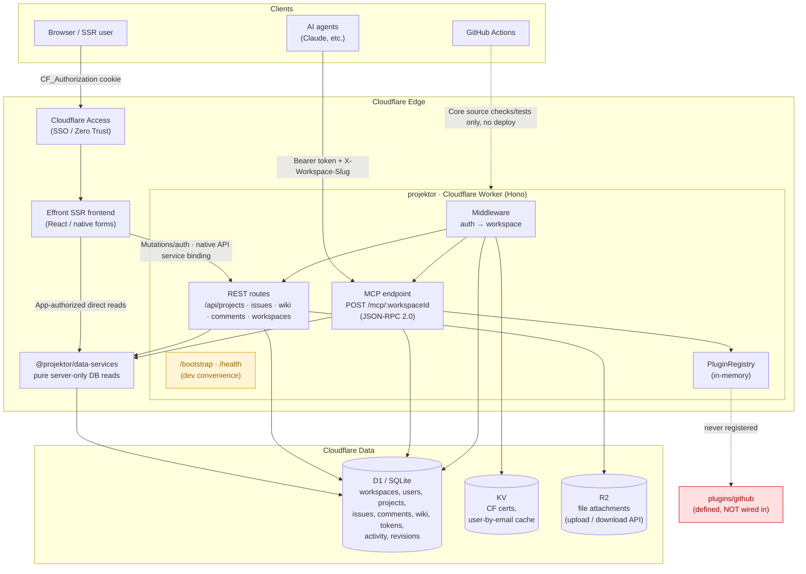

import mcpStats from "../../../generated/mcp-stats.json";

> Wiki + Jira-style issue tracker built MCP-native, running entirely on Cloudflare's edge.
> Monorepo (pnpm + VitePlus), deployed from one source-owned Alchemy stack.

This page maps how Projektor is actually built — its surfaces, service layer, and
storage — including what is wired up and what isn't yet. It describes the system as
it stands today, not an idealised summary.

## How it works

Projektor's source-owned Alchemy stack contains a Hono API Worker (`apps/api`) and an Effront SSR frontend (`apps/web`).
The API exposes REST and MCP (JSON-RPC 2.0) surfaces over the same application services; MCP is the primary surface for AI agents.
API HTTP requests pass through Access/bearer authentication and workspace membership middleware before handlers.
Web verifies browser identity through API `/auth/me`, then applies its own request-local membership/project visibility policy before server-only direct D1 reads.
Both apps reuse pure Effect-based queries from `@projektor/data-services`; authorization, mutations and UI/API shaping remain app-owned.
Native API Worker service-binding HTTP carries mutations and retained auth/share/file operations with the actual user credential and workspace scope.
The browser uses native forms/Effront transport, never direct API fetch or database access.

State lives entirely on Cloudflare's edge. **D1** (SQLite) holds the relational data -
workspaces, users, projects, issues, comments, wiki pages, tokens, activity, and
revisions. **KV** caches Access certs and email lookups. **R2** holds
file attachments.
The API and frontend run as Cloudflare Workers and share the existing external D1 ID in production, or one native `LocalDatabase` declaration in dev; KV/R2 remain API-only.

That storage choice is load-bearing, not incidental. Coordination state — issue leases,
file claims, workspace membership — is shared, durable, and workspace-scoped in D1,
reachable by any client that can make an HTTPS request. Two agents on two machines, or
an agent and a CI job, read and write the same lease and claim rows and see each other's
state immediately. A tool that keeps this state in a local SQLite file or an in-repo
JSONL log cannot do that: two machines don't share a filesystem, and a CI job doesn't
have a persistent one to write to. That's a ceiling on what a local-first design can
coordinate — a whole class of cross-machine and agent/CI fleets is unreachable no matter
how good its primitives are — not a convenience Projektor happens to also offer.

Deployment is source-owned through root `alchemy.run.ts` and `just dev`, `just plan`, and `just deploy`, not a config-only example repository or standalone Wrangler workflow.
Preserve existing Worker names, resource identities, Access policy and the actual deployment `JWT_SECRET`; `/bootstrap` remains gated to non-production environments.
Alchemy CLI profile authentication is required even for local commands, and a plan is not a build or proof of deployment.
See [Deploying & operating](/projektor/guides/deploying/) for the full mechanics.

The sections below give the picture in increasing detail — first a diagram, then a
layer-by-layer breakdown, then the request flow through a single agent call.

## System diagram

## Layer breakdown

| Layer | Tech | Package | Notes |
|-------|------|---------|-------|
| Frontend | React + Effront SSR | `apps/web` | Issues, board, sprints, wiki, settings and tokens. Request-local identity, shared D1 reads, native forms and Effect HTTP mutations over the API service binding. |
| Documentation | Astro | `apps/docs` | Retained documentation site, separate from the replaced application frontend. |
| API / edge runtime | Hono on Cloudflare Workers | `apps/api` | REST + MCP, two-mode auth, workspace tenancy. |
| MCP server | JSON-RPC 2.0 over HTTP | `apps/api/src/routes/mcp.ts` | {mcpStats.tools} tools across {mcpStats.domains} domains (coordination + project data). Primary surface. |
| Plugin system | Registry + SDK | `apps/api/src/plugins`, `packages/plugin-sdk` | `definePlugin` / `defineMCPTool`. **Not loaded at runtime.** |
| Data model | Drizzle ORM → D1 | `packages/db` | Drizzle is the schema and primary query layer; raw `DB.prepare` remains in the auth/workspace middleware hot path, the dev bootstrap, and a handful of service queries (FTS, counters) where hand-written SQL is clearer. |
| Shared DB reads | Effect + Drizzle/raw D1 | `packages/data-services` | Pure queries reused by API/Web; apps supply trusted policy predicates and shape UI/API results. No HTTP, credentials, UI or mutation logic. |
| Shared types | TS | `packages/types` | `HonoEnv`, `Plugin`, `MCPTool`, `PluginContext`. |
| Auth | CF Access JWT (RS256) + API tokens (SHA-256) | `middleware/auth.ts` | Plus dev bypass via `DEV_USER_EMAIL`. |
| Deploy | Alchemy `2.0.0-beta.79` + official Effront `0.2.0` | Root `alchemy.run.ts` | Production account/Access/secret preflight is separate from runtime identity/binding resolution; no production storage lifecycle ownership. |
| Toolchain | VitePlus | Root and package tasks | Only `ci.yml` runs core/infra format and typed lint, API/Web/DB/data-services tests and Alchemy configuration regressions. `just check` shares its check/format tasks. No docs/plugin pipeline, E2E or deploy job; broader docs/plugin tasks remain optional local maintenance. |

## API surfaces

REST (`/api/*`) is the frontend's **private contract** — versionless, and may change shape
between releases without notice. MCP (`/mcp/:workspaceId`) is the **stable public
surface** for agents. The two are usually kept at parity (see `AGENTS.md`'s
service-layer contract), but a small, documented subset of REST endpoints — file
attachments, tokens, public share links, feedback submission — has no MCP
equivalent and is safe to depend on; see [REST endpoints](/projektor/agents/rest-endpoints/).

## Platform constraints

A few Cloudflare platform limits are encoded directly in the service layer, not just
implied by the runtime:

- **D1 rejects any query with more than 100 bound parameters.** A query whose parameter
  count scales with an input array — `inArray`, a raw `IN (...)`, a batched mutation
  keyed by ids — throws once the array is large enough. This is invisible in tests: the
  vitest runner backs D1 with SQLite, whose limit is 32766, so an un-chunked query passes
  CI and only fails against real D1. `inChunks` in `apps/api/src/services/sql.ts` splits
  such queries into chunks of 90 (leaving headroom for the query's other predicates), and
  is used wherever a query binds a caller- or row-scaled array, e.g.
  `apps/api/src/services/issue-links.ts` and `apps/api/src/services/wiki-links.ts`.
- **D1 has no interactive transactions.** A read-then-insert can race: two concurrent
  claims can each see "one slot free" and both proceed. `claimIssue` in
  `apps/api/src/services/issue-leases.ts` (PROJ-290) avoids this by folding both
  atomicity guards — a per-issue uniqueness check and a per-project WIP-cap count — into
  a single INSERT, relying on SQLite's write lock rather than a transaction boundary.
  Multi-statement atomic writes elsewhere use `ctx.db.batch()` instead, e.g.
  `apps/api/src/services/wiki.ts`.
- **D1 limits compound SELECT to a small number of terms.** `fetchActivityRows` in
  `apps/api/src/services/project-activity.ts` runs one query per event category and
  merges and sorts the results in JS rather than a single UNION.
- **A Worker isolate has a 128 MB memory ceiling.**
  `apps/api/src/services/wiki-export.ts` bounds wiki export size against it — a hard cap
  of 500 pages and 100 MB of attachments per export, on top of the existing 50 MB
  per-file upload cap in `apps/api/src/services/files.ts`. A streaming zip build is the
  primary defense against buffering the whole export into memory; these caps are a
  fast-failing backstop against pathological page counts or attachment totals.

## Request flow

1. **Agent** → `POST /mcp/:workspaceId` with `Authorization: Bearer pk_…` + `X-Workspace-Slug`.
2. `authMiddleware`: CF Access JWT → API-token (D1 hash lookup) → dev bypass.
3. `workspaceMiddleware`: resolve slug → load workspace → verify `workspace_members` row.
4. MCP router dispatches one of three method groups:
   - `initialize` — server info and capabilities.
   - `tools/list` / `tools/call` → core tool handler → D1.
   - `prompts/list` / `prompts/get` → a composed [playbook](/projektor/agents/playbooks/)
     directive. `prompts/get` delegates to `compose_playbook`, so it reads the epic it is
     given but is otherwise served from the shipped templates, not the database.

Workspace membership is only the outer gate. Which *projects* a member can see and
what they can do inside them is decided per-request in the service layer — see
[Access control](/projektor/architecture/access-control/).
