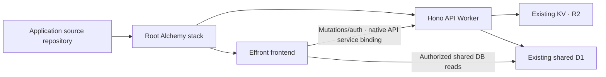

## Deployment model

This fork deploys from the application source repository using one root Alchemy stack in `alchemy.run.ts`.
The stack contains the Hono API in `apps/api` and the React/Effront frontend in `apps/web` as separate logical applications.
The former independent `apps/ssr` app was moved into `apps/web` after deleting the Astro/Preact frontend.
The Astro documentation site remains in `apps/docs`.

There is no required config-only deployment example, downloaded static release artifact or standalone Wrangler deployment configuration in this workflow.
Older upstream self-hosting/release descriptions are not the operator contract for this fork.
Use the source-owned root `justfile` rather than a deployment script in an example repository.



The stack pins Alchemy to `2.0.0-beta.79` and the official Effront packages to `0.2.0`.
Use those published integration APIs, not a substituted renderer or private framework hooks.
Effront builds its real RSC/client/nested SSR application through the stack's frontend integration.
Alchemy at this version has no standalone build CLI, and `plan` is not a build command.

## Operator entry points

Run these from the source repository root:

```bash
just dev
just plan
just deploy
```

- `just dev` starts the stack's local development workflow.
- `just plan` asks Alchemy to inspect the planned deployment changes. It is not proof that application bundles build or that production acceptance passed.
- `just deploy` applies the stack to Cloudflare. Run it only when deployment is explicitly authorized and the plan, metadata and credential prerequisites have been reviewed.

Worker stack metadata and operator prerequisites live in `infra/config.ts`, and API hosting/bindings live in `infra/api.ts`.
The root stack uses Alchemy `localState()` with Cloudflare providers, so retain its local state and keep `.alchemy/` out of Git.
Production plan/deploy recipes select `--stage production`.

Root `ApiDeploymentPreflight` validates the resolved Cloudflare account against the preserved production account, plus Access confirmation and the existing secret, before registering either Worker.
Worker definitions use public Alchemy APIs and separate deployment evaluation from `ALCHEMY_PHASE === "runtime"`: runtime resolves symbolic Worker identity/service bindings, never production configuration or child storage declarations.
The API and frontend share one native `LocalDatabase` declaration in dev; production binds the same existing external D1 ID to both Workers using public `Worker.bind`.
KV, OAuth KV and R2 remain API-only bindings.

Before either production command, provide the existing non-empty `JWT_SECRET` through the deployment environment and set `PROJEKTOR_ACCESS_CONFIRMED=true` only after confirming the existing frontend hostname is protected by the intended Access application/policies.
That flag is an operator confirmation, not a remote protection check, and the stack does not create or reset Access policies.
A missing or empty production secret fails closed: beta.79 does not preserve omitted Worker secrets, so omitting the value is not a safe preservation strategy.
Local development uses a deliberately local-only secret and separate emulated storage, never a generated production replacement.

Inspect the maintained recipes with `just --list`.
The Alchemy CLI requires an authenticated profile even for local development and planning.
An API token or application source alone does not remove that prerequisite, so do not describe these commands as an unauthenticated offline smoke test.
Stop at a missing profile or other operator-controlled prerequisite rather than changing authentication or attempting a production deployment to test local tooling.

VitePlus owns integrated task execution, Oxlint/Oxfmt checks, type checking and tests.
Use the repository's task recipes for those checks and the retained documentation build.
Use `just check`, `just test` and `just format` for integrated type/lint/format, package tests and formatting.
Only `.github/workflows/ci.yml` remains active: after a frozen install it runs `pnpm exec vp run ci`.
Root `vite.config.ts` defines formatting and typed lint for core runtime source, `infra/` and `alchemy.run.ts`, plus API/Web/DB/data-services tests and `test:infra` configuration regressions.
There are no docs/plugin pipelines, API coverage generation, browser E2E or deploy jobs in minimal CI.
`just check` runs the same `ci:check` and `ci:format` tasks; `just test` runs `test:packages`, including infra tests.
The broader root `type-check` script remains available for optional docs/plugin maintenance, but is not the `just check` contract.
Generated docs remain maintained manually through their existing generators; regenerate conventions alone with `corepack pnpm exec tsx scripts/gen-conventions-page.ts`.
Production/preview GitHub Actions are separate follow-up [TOT-252](https://linear.app/totto2727/issue/TOT-252/projektor-alchemy本番プレビューデプロイのgithub-actionsを整備).
`pnpm build` runs the docs package build task, not a standalone Alchemy Worker build.
The source-owned `just e2e` recipe targets the official local runtime host for the real Worker graph, separate from the Alchemy CLI profile prerequisite.
Successful execution of a recipe still requires observing its result, not assuming it passed from its existence.

Turbo, Biome, Lefthook and the removed Astro app's island/E2E checks are no longer the current toolchain contract.

## Existing deployment compatibility

Reference existing production storage through public `Worker.bind` entries using the exact external D1/KV/R2 resource IDs in the source-owned configuration.
These are binding references, not adoption as new Alchemy-managed storage resources.
Do not interpret a source migration as permission to create replacement resources.

| Deployment property | Required preservation |
| --- | --- |
| API Worker | Keep its deployed name `projektor`, identity and public endpoint. |
| Frontend | Keep Worker name `projektor-frontend` and endpoint `https://projektor.totto2727.dev`, rather than selecting a fresh default. |
| D1 | Retain the existing database identity and data, binding the same external ID to both API and Web for shared reads. Do not create an empty replacement or assume deployment applied migrations. |
| KV | Retain the separate cache and OAuth namespaces. Clearing/replacing OAuth storage invalidates connector grants. |
| R2 | Retain the existing bucket and attachments. |
| Durable Objects | Preserve the deployed `RATE_LIMITER` binding to the `RateLimiter` class. `WorkspaceHub` remains unbound on this deployment. Do not replay historical v1/v2 migrations or introduce a new binding as part of the import. |
| Access | Preserve the configured team domain, audience and existing policies. Hosting changes do not authorize replacement or relaxation of Access rules. |
| `JWT_SECRET` | Supply the actual existing secret from the deployment environment. Never generate a new value during import, planning or deployment. |

Check the resolved names and resource identities before applying a plan.
A new stack's lack of local state is not evidence that the existing remote resources are disposable.
Do not run destructive stack teardown as a migration step.
`JWT_SECRET` signs OAuth consent tokens; changing it disrupts outstanding consent tokens and is a separate sensitive operation, not routine deployment.
API bearer tokens use stored SHA-256 hashes, so do not claim that their validity depends on this secret.
Keep real secret values out of source, logs, plan reports and documentation.

## API and authentication boundaries

The API continues to own Access/bearer authentication, mutation authorization, REST/MCP service parity and API response shaping.
Frontend SSR verifies the actual browser session through API `/auth/me`, then resolves runtime workspace/project context before loading protected data.
Pure server-only D1 reads live in `@projektor/data-services`, reused by API services and Web loaders without embedding authorization policy or UI/API shaping.
Web `server/data-context.ts` enforces membership/project visibility, supplies trusted predicates and redacts privileged metadata/errors; it rejects bearer-token direct-read scope and the shared public viewer.
The DB binding does not confer application access, and direct reads must remain workspace-scoped.
Mutations remain HTTP API operations through the native service binding, never Web direct DB writes.
The browser uses native forms and Effront transport, with no direct API fetch path or database access.
`PUBLIC_WORKSPACE_SLUG` is retired and is not a deployment tenant selector.

The frontend HTTP layer targets the trusted API through its Alchemy `API` Worker service binding, adapted with `fromCloudflareFetcher` and `toHttpClient`.
The configured logical API origin is `https://projektor-api.totto2727.dev`.
Native binding transport still targets the API Worker inside the stack.
The configured API URL is request/redirect metadata, not permission to send server credentials over arbitrary public network fetch.
It forwards the real request credential, not a shared privileged token or spoofed user header.
Ensure the API's configured Access audience and edge policy accept that credential under the actual hostname/cookie topology.
Do not solve a missing credential by relaxing backend checks.
Private HTML and Flight responses must not be shared between users by a cache.

OAuth discovery and machine-to-machine token requests must remain reachable without an Access login redirect, while `/oauth/authorize` remains protected for human consent.
Preserve existing carve-outs for `/.well-known/*` and `/oauth/token` rather than replacing policies during this migration.
There is no separate `/oauth/revoke` carve-out: revocation uses the token endpoint.
The workspace-specific protected-resource discovery path is `/.well-known/oauth-protected-resource/mcp/<workspace-id>`; the bare origin path intentionally returns 404.
Ensure those requests reach the API rather than the frontend HTML handler.

Login, session refresh and logout use native document forms so the previous identity's application runtime is discarded.
Native attachment GET/HEAD transport remains narrowly scoped and is not a generic browser API proxy.
Effront upload forms and inline image actions have a 10 MiB total request-body cap including multipart overhead, even though the unchanged API policy permits files up to 50 MiB.
Do not add transport bypasses to evade the framework cap.

## Branding and retained API operations

Deployment branding still uses the API's optional `BRAND_NAME`, `BRAND_MARK`, `BRAND_ACCENT`, `BRAND_ON_ACCENT` and `BRAND_LOGO_URL` settings.
The SSR frontend loads deployment and selected-workspace branding on the server and emits names, favicon and color variables before paint, rather than relying on the old client-island first-paint fetch.
Keep branding cosmetic and optional, separate from authenticated workspace/project selection.
Serve logos through an allowed same-origin asset/file path or a supported data URI rather than assuming arbitrary third-party image origins are allowed.

The API's scheduled retention remains unchanged: old Wiki notifications and ended unreferenced agent sessions default to 90 days, and activity history to one year, in bounded batches.
`WIKI_NOTIFICATION_RETENTION_DAYS`, `AGENT_SESSION_RETENTION_DAYS` and `ACTIVITY_RETENTION_DAYS` retain their existing configuration roles.
Issue leases are not age-pruned because historical flow metrics depend on them, and Wiki revisions are not pruned by this cron.
Retain the schedule in the hosting integration, not just the API handler source.
Subdomain workspace routing remains opt-in through `WORKSPACE_SUBDOMAIN_ROUTING`; scoped client requests continue to supply their workspace explicitly.

## Verification and operating limits

Source checks and a clean plan are not evidence of a successful production deployment.
A final validation run must use the real Effront RSC/nested SSR artifact together with the API, held stable while browser acceptance is performed.
Check cold loads, workspace/project switches, denial/error behavior, native GET filters, URL tabs, Back/Forward, native actions and canonical refresh, attachment limits, authentication transitions and credential isolation.
Earlier measurements on the standalone SSR snapshot do not establish acceptance for this Alchemy-integrated source tree.

Run the relevant package checks through the current task entry points; docs generation/build tasks are available locally but are not part of minimal CI.
The integration currently belongs to source branch `feat/alchemy-deployment`, not an asserted production rollout or passing browser E2E result.
Record profile/authentication or deployment prerequisites honestly when they block real verification.
Do not claim remote migrations, resource imports or production releases from local source inspection alone.

The maintained [fork differences record](https://github.com/totto2727-org/projektor/blob/main/docs/upstream-differences.md) explains the full source divergence, including the immutable fork point and the separately maintained upstream comparison baseline.
