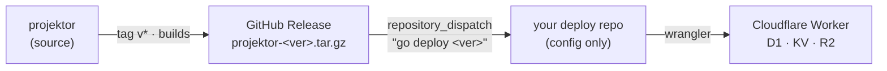

Projektor ships as a **self-contained release artifact** and deploys from **config
only**. There is no source checkout, no submodule, and no build step on the deploy
machine. This page covers the model, how to stand up your own
instance, how releases are cut, and how to keep an instance updated automatically.

> Looking for the 5-minute version? See [Self-hosting](/projektor/guides/self-hosting/).
> A ready-to-fork template lives at
> [github.com/TAJD/projektor-deploy-example](https://github.com/TAJD/projektor-deploy-example) -
> including a **Deploy to Cloudflare** button and a zero-config `deploy-auto.sh` (plus
> `AGENT-DEPLOY.md` / `CONFIGURE.md`) that auto-provision D1/KV/R2 with no manual setup.
> This page is the manual / CI reference.

## The model

Three repositories, with a clean producer → consumer split:



- **`projektor`** — the source. Tagging `v*` builds a release artifact and publishes
  it to a GitHub Release. Stays generic: it knows nothing about any particular
  deployment.
- **Your deploy repo** — holds *only* configuration: a `wrangler.toml` with your
  Cloudflare resource IDs, a pinned `projektor.version`, and a deploy workflow.
  [`projektor-deploy-example`](https://github.com/TAJD/projektor-deploy-example) is
  the public template; copy it.

The deploy machine needs only **`wrangler`** and **`gh`**, not the source workspace's `Bun` dependencies,
`node_modules`, or the projektor source.

## What's in a release

Each `projektor-<version>.tar.gz`, extracted into `./vendor`:

| Path | Contents |
|------|----------|
| `vendor/worker.js` | the entire Worker, bundled and self-contained (Hono, Drizzle, all deps inlined — only `node:*` builtins remain, provided by `nodejs_compat`) |
| `vendor/web/` | the pre-built frontend, served as static assets |
| `vendor/migrations/` | D1 migrations |
| `vendor/wrangler.example.toml` | the config template (`compatibility_date` baked from source) |
| `vendor/VERSION` | the version string |

These four travel together at one version — a migration, the code that reads it,
and the frontend that calls it are always in lockstep.

## Deploy your own instance

### 1. Fork the deploy example

**Fork
[`projektor-deploy-example`](https://github.com/TAJD/projektor-deploy-example)** -
it becomes your deploy repo.

```bash
gh repo fork TAJD/projektor-deploy-example --clone
cd projektor-deploy-example
```

> A fork is public. If you want your config (resource IDs) kept private, create
> from the template instead:
> `gh repo create my-projektor-deploy --private --template TAJD/projektor-deploy-example`.

### 2. Provision Cloudflare resources

```bash
wrangler d1 create projektor
wrangler kv namespace create projektor
wrangler kv namespace create projektor-oauth
wrangler r2 bucket create projektor-files
```

`projektor-oauth` is a second, separate KV namespace holding OAuth grants and
tokens for MCP connectors. Keeping it apart from the cache namespace means
clearing the cache never signs every connector out.

### 3. Configure `wrangler.toml`

Pin a version and run the deploy script once — it downloads the release and
scaffolds your `wrangler.toml` from the template:

```bash
gh release list -R TAJD/projektor          # find a real tag - releases are all v0.x so far
echo "v0.3.7" > projektor.version          # pin whichever tag you picked
./deploy.sh                                 # creates wrangler.toml, then asks you to fill it
```

Fill in the `REPLACE_` values: D1 `database_id`, both KV `id`s (`KV` and
`OAUTH_KV`), your Cloudflare Access team domain and audience, and `ADMIN_EMAILS`.
The artifact-owned paths (`main = ./vendor/worker.js`,
`[assets].directory = ./vendor/web`, `migrations_dir = ./vendor/migrations`) and
`compatibility_flags` are already set — leave them. The flags are not decoration:
dropping `global_fetch_strictly_public` or `cache_option_enabled` makes the server
advertise OAuth client registration support it does not have, and every attempt to
add it as a connector in Claude fails.

### 4. Cloudflare API token — include D1

This is the step that most often goes wrong. **Do not** use Cloudflare's built-in
"Edit Cloudflare Workers" token template: it omits D1, so `wrangler deploy`
succeeds but `wrangler d1 migrations apply` fails with an auth error.

Create a **Custom Token** (My Profile → API Tokens → Create Token → Create Custom
Token) with:

| Type | Permission | Access |
|------|-----------|--------|
| Account | Workers Scripts | Edit |
| Account | **D1** | **Edit** |
| Account | Workers KV Storage | Edit |
| Account | Workers R2 Storage | Edit |
| Account | Account Settings | Read |

- **Account Resources:** Include → your account.
- **Zone Resources:** none needed on `*.workers.dev`. Add `Zone → Workers Routes →
  Edit` (scoped to your zone) only if you serve on a custom domain.

Verify it before wiring CI:

```bash
CLOUDFLARE_API_TOKEN=xxx CLOUDFLARE_ACCOUNT_ID=yyy wrangler d1 list   # must succeed
```

If `d1 list` errors, the token is missing the D1 permission.

### 5. Secrets

**GitHub Actions** (your deploy repo → Settings → Secrets and variables → Actions):

| Secret | Purpose |
|--------|---------|
| `CLOUDFLARE_API_TOKEN` | the custom token from step 4 |
| `CLOUDFLARE_ACCOUNT_ID` | target account (`wrangler whoami`) |
| `PROJEKTOR_RELEASE_PAT` | only if `projektor` is **private** — a fine-grained PAT with `Contents: Read` on it, so CI can download the release asset. For a public projektor, use the built-in `GITHUB_TOKEN` instead. |

**On the Worker** (set once; persists across every deploy — *not* a GitHub secret):

```bash
wrangler secret put JWT_SECRET     # any long random string, used to sign API tokens
```

CI never manages runtime secrets — it only needs the deploy token. Rotating
`JWT_SECRET` invalidates existing API tokens, so set it once and leave it.

### 6. Cloudflare Access carve-outs for OAuth

Skip this if your instance isn't behind Cloudflare Access. If it is, MCP
connectors will not work until you do it, and the failures are confusing
because Access answers with a *redirect to a login page*, not an error.

Two of the OAuth endpoints are machine-to-machine and are never fetched by the
browser that holds your Access session:

| Path | Fetched by | Must be |
|------|-----------|---------|
| `/.well-known/*` | the client, before any sign-in exists | bypassed |
| `/oauth/token` | the client's server, with no cookies | bypassed |
| `/oauth/authorize` | your browser, to press "Allow access" | **left protected** |

`/oauth/authorize` is where the human consents, so it needs the Access identity
— that's the whole point of it. Bypassing it would let anyone reach the consent
screen.

An Access policy applies to a whole application, and applications are scoped by
hostname *plus path*, so a carve-out means **separate applications**, one per
path, each with a single Bypass / Everyone policy. More specific paths win over
less specific ones, so these sit alongside your existing app without changing it:

- `projektor.example.com/.well-known` → self-hosted app, policy: Bypass, Everyone
- `projektor.example.com/oauth/token` → self-hosted app, policy: Bypass, Everyone

There is no `/oauth/revoke` to bypass. RFC 7009 revocation is served on the
token endpoint itself, which is why the metadata advertises
`revocation_endpoint` equal to `token_endpoint`.

Verify before adding the connector — both should return `200` with JSON, not
`302`:

```bash
curl -si https://projektor.example.com/.well-known/oauth-authorization-server | head -1
curl -si https://projektor.example.com/.well-known/oauth-protected-resource/mcp/<workspace-id> | head -1
```

The bare `/.well-known/oauth-protected-resource` (no workspace suffix) returns
`404` on purpose — a projektor instance hosts many workspaces, so there is no
single resource to describe at the origin. Only the RFC 9728 §3.1 path-suffixed
form is served.

Also confirm your `wrangler.toml` `run_worker_first` includes `/.well-known/*`
alongside `/api/*`, `/mcp/*` and `/wiki`. Without it the static-asset handler
answers discovery requests with the SPA shell and the client reports the server
as not supporting OAuth at all.

### 7. Realtime WebSockets (optional)

To enable live event streaming over `/api/workspaces/:slug/realtime` (for external dashboards and status boards), bind the `WorkspaceHub` Durable Object in your `wrangler.toml`:

```toml
[[durable_objects.bindings]]
name = "WORKSPACE_HUB"
class_name = "WorkspaceHub"

[[migrations]]
tag = "v1"
new_sqlite_classes = ["WorkspaceHub"]
```

If the binding is omitted, the Worker operates in standard polling mode with zero
overhead. **Keep the `v1` migration even if you leave the binding out**, and keep it
above the rate limiter's `v2` (below): wrangler only applies migrations after the last
tag it deployed, so a `v1` added after `v2` is skipped and WorkspaceHub is never created.

### 7a. Rate limiter (required)

Request rate limits (`RATE_LIMIT_*` vars) are counted in the `RateLimiter` Durable
Object, one object per API token or client IP, held in memory — no D1 write per
request (PROJ-867). It is SQLite-backed, so it works on the Workers Free plan.
`wrangler.example.toml` already includes it:

```toml
[[durable_objects.bindings]]
name = "RATE_LIMITER"
class_name = "RateLimiter"

[[migrations]]
tag = "v2"
new_sqlite_classes = ["RateLimiter"]
```

**Upgrading:** add these blocks, and the `v1` migration from step 7 if you don't have it,
to your existing `wrangler.toml` (if you used the older `[durable_objects]
bindings = [ … ]` table form, convert it to `[[durable_objects.bindings]]` entries —
TOML can't mix the two). Deploying resets every rate-limit window. Until you add the
binding, the Worker falls back to the deprecated D1 limiter and logs a warning; that fallback is
removed in a later release (PROJ-924), after which a missing binding disables rate
limiting.

### 8. Deploy

```bash
./deploy.sh          # locally (wrangler OAuth), or
git push             # CI deploys on push to main
```

## How a deploy works

`deploy.sh` is the whole contract — it runs identically locally and in CI:

```bash
gh release download "$(cat projektor.version)" -R OWNER/projektor -p 'projektor-*.tar.gz'
tar -xz -C vendor                                    # extract artifact
wrangler d1 migrations apply projektor --remote      # idempotent; only new migrations run
wrangler deploy                                       # upload worker + assets
```

Your `wrangler.toml` points `main`, `[assets].directory`, and `migrations_dir` at
`./vendor/...`, which the extract step populates. `vendor/` is gitignored.

## Branding your instance

Setting a handful of `[vars]` in your `wrangler.toml` rebrands the whole deployment —
topbar, favicon/app icon, `theme-color`, and the accent colour used throughout the UI.
Every field is optional and falls back to Projektor's own look; these are read at
runtime from `GET /api/config/brand` and applied client-side, so re-deploying the
shared release artifact (a version bump, no rebuild) picks up a change immediately.

```toml
[vars]
BRAND_NAME = "Acme Projects"
BRAND_MARK = "A"
BRAND_ACCENT = "#16a34a"
BRAND_ON_ACCENT = "#ffffff"
BRAND_LOGO_URL = "/brand/logo.svg"
```

| Var | Effect | Default |
|-----|--------|---------|
| `BRAND_NAME` | Topbar text, page title, PWA/OG metadata | `Projektor` |
| `BRAND_MARK` | The single-character topbar mark | first letter of `BRAND_NAME`, or `P` |
| `BRAND_ACCENT` | Overrides `--accent` in both light and dark themes, and `theme-color` | `#4f46e5` light / `#6366f1` dark |
| `BRAND_ON_ACCENT` | Text colour drawn on top of `--accent` — set this if your accent is pale, since it is not auto-derived | `#ffffff` |
| `BRAND_LOGO_URL` | Replaces the favicon and Apple touch icon | Projektor's own icons |

`BRAND_LOGO_URL` must be same-origin (an absolute path served by your own instance) or
a `data:` URI — the response's `Content-Security-Policy` restricts `img-src` to
`'self' data: blob:` and is generated once at release-build time, so it cannot be
widened per deployment. Host your logo under `/public` in a fork, or via R2/`/api/files`,
rather than pointing at a third-party URL.

Branding applies after the page's first paint (there's a brief flash of Projektor's
own name/mark before the fetch resolves) and does not yet reach the PWA manifest's
app name or icons — tracked as a known follow-up, not blocking for a v1.

## Upgrade notes

**Subdomain-based workspace routing is now opt-in.** Set `WORKSPACE_SUBDOMAIN_ROUTING=true`
if you rely on subdomain-based tenant routing; otherwise clients must send the
`X-Workspace-Slug` header.

## Cutting a release (maintainers)

Releases are tag-driven. From the `projektor` repo:

```bash
git tag v1.2.0 && git push --tags
```

`.github/workflows/release.yml` then builds the artifact (web build → bundle worker
→ collect migrations → write `wrangler.example.toml`) and publishes a GitHub
Release with `projektor-v1.2.0.tar.gz` attached.

## Automatic updates

An instance can track the latest release automatically — push-based, so a new
release deploys within seconds and the producer stays generic.

How it's wired:

1. In `projektor`, set a repository **variable** `DEPLOY_DISPATCH_REPO` to your
   deploy repo (e.g. `YOU/my-projektor-deploy`) and add a `WORKSPACE_PAT` secret
   that can POST dispatches to it:
   - **Classic PAT:** the `repo` scope.
   - **Fine-grained PAT:** the deploy repo must be in *Repository access* **and**
     the token must grant *Repository permissions → Contents: Read and write* -
     you need **both**. Granting the permission without selecting the repo (or vice
     versa) silently fails.

   > **Gotcha:** if the PAT can't see the repo or lacks `Contents: write`, the
   > dispatch fails with **HTTP 404 "Not Found"** — *not* 403. GitHub masks a
   > permission failure as a missing resource, so a 404 on the dispatch step means
   > "fix the PAT's repo access / Contents permission," not "wrong URL."

   The release workflow's final step fires a `repository_dispatch`
   (`projektor-release`, payload `version`) — but only if `DEPLOY_DISPATCH_REPO`
   is set, so projektor remains generic for everyone else.
2. Your deploy workflow listens for that dispatch, records the released tag into
   `projektor.version` (a `[skip ci]` commit), and deploys.

The result: `git push --tags` in `projektor` → your instance is running the new
version, no manual step. To deploy by hand instead, bump `projektor.version`,
commit, and push.

## Operating notes

- **Data retention (PROJ-869):** a daily cron (`scheduled` in `apps/api/src/index.ts`)
  prunes tables that would otherwise grow forever, in small bounded batches per run so a
  large backlog is worked off over several days rather than in one invocation:
  - `wiki_notifications` older than 90 days (`WIKI_NOTIFICATION_RETENTION_DAYS`)
  - ended `agent_sessions` older than 90 days, but only ones no `issue_leases` row
    references (`AGENT_SESSION_RETENTION_DAYS`)
  - `activity` (the audit/diff log behind `list_wiki_changes` and project activity feeds)
    older than 1 year (`ACTIVITY_RETENTION_DAYS`)

  `issue_leases` itself is never pruned by age — flow metrics (autonomy ratio, flow
  efficiency, lease expiries) read old leases directly, so deleting them would silently
  zero out historical reporting.

  All three env vars above are overridable via the matching `[vars]` in `wrangler.toml`,
  same as any other setting there: changing them still needs a deploy (`wrangler deploy` /
  the release workflow) to take effect. `wiki_revisions` (page history) is never pruned by
  this cron; that's tracked separately if it's ever wanted.
- **Roll out a specific version:** `echo "v1.3.0" > projektor.version && git commit -am … && git push`.
- **Migrations** apply automatically on every deploy and are idempotent — only
  unapplied ones run (`✅ No migrations to apply!` when there are none).
- **Deploy triggers** are scoped: the deploy workflow runs on changes to
  `projektor.version`, `wrangler.toml`, `deploy.sh`, or the workflow itself — so
  documentation edits don't trigger redeploys, but version bumps do.
- **Releases & changelog:** every tagged release is listed at
  [github.com/TAJD/projektor/releases](https://github.com/TAJD/projektor/releases).

## Troubleshooting

| Symptom | Cause / fix |
|---------|-------------|
| `wrangler d1 migrations apply` fails with an auth error | The API token is missing **D1: Edit** (the "Edit Cloudflare Workers" template omits it). Recreate as a custom token; verify with `wrangler d1 list`. |
| Adding the MCP connector fails with "does not support OAuth" / discovery 404s | `/.well-known/*` is missing from `run_worker_first`, so the SPA fallback answers discovery instead of the Worker. |
| Connector fails with "CIMD is enabled but `global_fetch_strictly_public` compatibility flag is not set" | The deployed Worker is running without the flag. It is in the template, but a config edit only takes effect on the next `wrangler deploy` — redeploy. |
| Discovery or token requests return `302` to a Cloudflare login page | Cloudflare Access is in front of them. Add the two bypass applications from step 6 — and leave `/oauth/authorize` protected. |
| Consent screen renders but pressing **Allow access** is blocked by CSP | You are on a build before v0.6.2: `form-action 'self'` blocked the redirect to the client, and Chrome reports it against `/oauth/authorize`, which looks like a false positive. Upgrade. |
| `Wrangler requires at least Node.js v22` | Your workflow uses an older Node. wrangler 4.x needs **Node ≥ 22** — set `node-version: '22'` in `setup-node`. |
| Release published but the instance didn't auto-deploy | The `DEPLOY_DISPATCH_REPO` variable is unset, or `WORKSPACE_PAT` can't dispatch to the deploy repo. The dispatch step fails with **HTTP 404** (GitHub masks a permission failure as "Not Found"). Fix: a fine-grained `WORKSPACE_PAT` needs the deploy repo selected in *Repository access* **and** *Contents: Read and write*. |
| `gh release download` 404 in CI | `projektor` is private and `PROJEKTOR_RELEASE_PAT` (with `Contents: Read`) is missing or expired. |
| Auto-bump commit triggers a second deploy | The bump commit must include `[skip ci]` and be pushed by `GITHUB_TOKEN` (which doesn't re-trigger workflows). |
